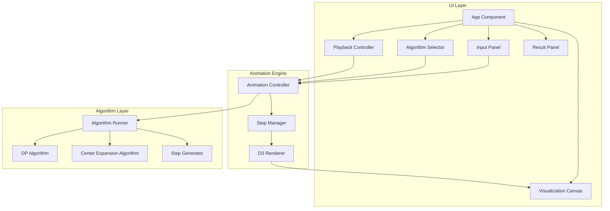

# Design Document

## Overview

Palindrome Visualizer 是一个基于 TypeScript + React + D3.js 的单页面算法可视化应用。系统采用分层架构，将算法逻辑、动画引擎和 UI 组件解耦，实现可扩展的算法演示平台。

核心设计理念：
- **算法与可视化分离**：算法执行生成步骤数据，动画引擎消费步骤数据进行渲染
- **声明式动画**：每个动画步骤是一个不可变的状态快照，支持任意跳转
- **响应式布局**：使用 CSS Grid/Flexbox 实现单屏幕自适应布局

## Architecture



## Components and Interfaces

### 1. 核心数据类型

```typescript
// 算法类型枚举
type AlgorithmType = 'dp' | 'center-expansion';

// 动画步骤基础接口
interface AnimationStep {
  stepNumber: number;
  totalSteps: number;
  description: string;
  highlightedIndices: number[];
  currentLongestPalindrome: {
    start: number;
    end: number;
    text: string;
  };
}

// DP 算法特有步骤数据
interface DPAnimationStep extends AnimationStep {
  type: 'dp';
  dpTable: boolean[][];
  currentCell: { row: number; col: number };
  cellState: 'checking' | 'palindrome' | 'not-palindrome';
}

// 中心扩散算法特有步骤数据
interface CenterExpansionStep extends AnimationStep {
  type: 'center-expansion';
  centerIndex: number;
  centerType: 'single' | 'double';
  leftPointer: number;
  rightPointer: number;
  expandState: 'expanding' | 'matched' | 'mismatched' | 'boundary';
}

// 统一步骤类型
type VisualizationStep = DPAnimationStep | CenterExpansionStep;

// 动画状态
interface AnimationState {
  input: string;
  algorithm: AlgorithmType;
  steps: VisualizationStep[];
  currentStepIndex: number;
  isPlaying: boolean;
  playbackSpeed: number; // 0.5 - 3.0
  isComplete: boolean;
}
```

### 2. 算法接口

```typescript
// 算法执行器接口
interface AlgorithmExecutor {
  execute(input: string): VisualizationStep[];
  getAlgorithmName(): string;
  getAlgorithmType(): AlgorithmType;
}

// DP 算法实现
class DPAlgorithmExecutor implements AlgorithmExecutor {
  execute(input: string): DPAnimationStep[];
  getAlgorithmName(): string;
  getAlgorithmType(): AlgorithmType;
}

// 中心扩散算法实现
class CenterExpansionExecutor implements AlgorithmExecutor {
  execute(input: string): CenterExpansionStep[];
  getAlgorithmName(): string;
  getAlgorithmType(): AlgorithmType;
}
```

### 3. 动画控制器接口

```typescript
interface AnimationController {
  // 初始化
  initialize(input: string, algorithm: AlgorithmType): void;
  
  // 播放控制
  play(): void;
  pause(): void;
  nextStep(): void;
  prevStep(): void;
  reset(): void;
  goToStep(stepIndex: number): void;
  
  // 速度控制
  setSpeed(speed: number): void;
  
  // 状态获取
  getCurrentStep(): VisualizationStep | null;
  getState(): AnimationState;
  
  // 事件订阅
  onStateChange(callback: (state: AnimationState) => void): () => void;
}
```

### 4. React 组件接口

```typescript
// 输入面板 Props
interface InputPanelProps {
  initialValue: string;
  onSubmit: (value: string) => void;
  disabled: boolean;
}

// 算法选择器 Props
interface AlgorithmSelectorProps {
  selected: AlgorithmType;
  onChange: (algorithm: AlgorithmType) => void;
  disabled: boolean;
}

// 播放控制器 Props
interface PlaybackControllerProps {
  isPlaying: boolean;
  currentStep: number;
  totalSteps: number;
  speed: number;
  onPlay: () => void;
  onPause: () => void;
  onNext: () => void;
  onPrev: () => void;
  onReset: () => void;
  onSpeedChange: (speed: number) => void;
}

// 可视化画布 Props
interface VisualizationCanvasProps {
  step: VisualizationStep | null;
  input: string;
  width: number;
  height: number;
}

// 结果面板 Props
interface ResultPanelProps {
  result: {
    palindrome: string;
    startIndex: number;
    endIndex: number;
  } | null;
  totalSteps: number;
  isComplete: boolean;
}
```

### 5. D3 渲染器接口

```typescript
interface D3Renderer {
  // 初始化 SVG 容器
  initialize(container: SVGElement, width: number, height: number): void;
  
  // 渲染 DP 表格
  renderDPTable(step: DPAnimationStep, input: string): void;
  
  // 渲染中心扩散
  renderCenterExpansion(step: CenterExpansionStep, input: string): void;
  
  // 渲染字符串显示
  renderStringDisplay(input: string, highlights: number[]): void;
  
  // 清除画布
  clear(): void;
  
  // 更新尺寸
  resize(width: number, height: number): void;
}
```

## Data Models

### 1. 应用状态模型

```typescript
interface AppState {
  // 输入状态
  input: string;
  inputError: string | null;
  
  // 算法状态
  selectedAlgorithm: AlgorithmType;
  
  // 动画状态
  animation: AnimationState;
  
  // UI 状态
  canvasSize: { width: number; height: number };
}
```

### 2. DP 表格数据模型

```typescript
interface DPTableModel {
  // n x n 布尔矩阵，dp[i][j] 表示 s[i..j] 是否为回文
  table: boolean[][];
  
  // 当前填充位置
  currentPosition: { row: number; col: number } | null;
  
  // 已填充的单元格列表（用于渲染）
  filledCells: Array<{
    row: number;
    col: number;
    isPalindrome: boolean;
  }>;
}
```

### 3. 中心扩散数据模型

```typescript
interface CenterExpansionModel {
  // 所有可能的中心点
  centers: Array<{
    index: number;
    type: 'single' | 'double';
  }>;
  
  // 当前中心索引
  currentCenterIndex: number;
  
  // 当前扩展状态
  expansion: {
    left: number;
    right: number;
    matchedPairs: Array<[number, number]>;
  };
}
```

### 4. 步骤序列化格式

```typescript
// JSON 序列化格式
interface SerializedStep {
  stepNumber: number;
  totalSteps: number;
  description: string;
  highlightedIndices: number[];
  currentLongestPalindrome: {
    start: number;
    end: number;
    text: string;
  };
  // 算法特定数据
  algorithmData: DPStepData | CenterExpansionStepData;
}

interface DPStepData {
  type: 'dp';
  dpTable: boolean[][];
  currentCell: { row: number; col: number };
  cellState: string;
}

interface CenterExpansionStepData {
  type: 'center-expansion';
  centerIndex: number;
  centerType: string;
  leftPointer: number;
  rightPointer: number;
  expandState: string;
}
```


## Correctness Properties

*A property is a characteristic or behavior that should hold true across all valid executions of a system-essentially, a formal statement about what the system should do. Properties serve as the bridge between human-readable specifications and machine-verifiable correctness guarantees.*

基于需求文档的验收标准分析，以下是系统必须满足的正确性属性：

### Property 1: 输入验证一致性

*For any* 输入字符串，验证函数应当：
- 当字符串仅包含数字和英文字母时返回有效
- 当字符串包含其他字符或为空时返回无效

**Validates: Requirements 1.1, 1.3**

### Property 2: 输入截断正确性

*For any* 长度超过50的有效字符串，截断后的结果应当：
- 长度恰好为50
- 内容为原字符串的前50个字符

**Validates: Requirements 1.4**

### Property 3: 算法切换状态保持

*For any* 当前输入字符串和算法类型，切换到另一种算法后：
- 输入字符串保持不变
- 动画状态被重置到初始步骤

**Validates: Requirements 2.2, 2.3**

### Property 4: DP 表格尺寸正确性

*For any* 长度为 n 的输入字符串，DP 算法生成的表格应当：
- 行数等于 n
- 列数等于 n

**Validates: Requirements 3.1**

### Property 5: 步骤描述完整性

*For any* 算法生成的动画步骤，每个步骤应当包含非空的描述文字

**Validates: Requirements 3.6, 4.7**

### Property 6: 最长回文更新单调性

*For any* 动画步骤序列，当前最长回文的长度应当：
- 单调不减（每一步的最长回文长度 >= 前一步）

**Validates: Requirements 3.5, 4.6**

### Property 7: 步骤导航一致性

*For any* 动画状态和当前步骤索引 i：
- 执行 nextStep 后，索引变为 min(i+1, totalSteps-1)
- 执行 prevStep 后，索引变为 max(i-1, 0)
- 执行 reset 后，索引变为 0

**Validates: Requirements 5.4, 5.5, 5.6**

### Property 8: 播放速度范围约束

*For any* 设置的播放速度值，实际应用的速度应当：
- 被限制在 0.5 到 3.0 之间（包含边界）

**Validates: Requirements 5.7**

### Property 9: 最终结果正确性

*For any* 输入字符串，算法执行完成后返回的最长回文子串应当：
- 确实是一个回文（正读反读相同）
- 是输入字符串的子串
- 长度等于或大于任何其他回文子串

**Validates: Requirements 7.1, 7.3**

### Property 10: 多回文确定性

*For any* 包含多个相同长度最长回文的输入字符串，算法应当：
- 始终返回相同的结果（第一个找到的）
- 结果的起始索引是所有最长回文中最小的

**Validates: Requirements 7.4**

### Property 11: 步骤序列化往返一致性

*For any* 动画步骤对象，序列化为 JSON 后再反序列化应当：
- 产生与原对象等价的步骤对象
- 保留所有必要字段（步骤编号、算法状态、高亮位置、说明文字）

**Validates: Requirements 8.2, 8.3, 8.4**

### Property 12: 步骤编号连续性

*For any* 算法生成的步骤数组，步骤编号应当：
- 从 1 开始
- 连续递增
- 最后一步的编号等于 totalSteps

**Validates: Requirements 8.1**

### Property 13: 中心扩散指针有效性

*For any* 中心扩散算法的动画步骤：
- leftPointer >= 0
- rightPointer < 字符串长度
- leftPointer <= rightPointer（或在边界情况下 leftPointer = rightPointer + 1）

**Validates: Requirements 4.2, 4.3**

### Property 14: DP 单元格状态一致性

*For any* DP 算法步骤中标记为回文的单元格 (i, j)：
- 对应的子串 s[i..j] 确实是回文

**Validates: Requirements 3.3**

## Error Handling

### 1. 输入错误处理

| 错误场景 | 处理方式 | 用户反馈 |
|---------|---------|---------|
| 空字符串 | 拒绝输入，保持当前状态 | 显示 "请输入至少一个字符" |
| 包含非法字符 | 拒绝输入，保持当前状态 | 显示 "只允许输入数字和英文字母" |
| 超长字符串 | 自动截断至50字符 | 显示 "输入已截断至50个字符" |

### 2. 动画错误处理

| 错误场景 | 处理方式 | 用户反馈 |
|---------|---------|---------|
| 步骤索引越界 | 限制在有效范围内 | 无（静默处理） |
| 渲染失败 | 重试一次，失败则显示错误 | 显示 "渲染失败，请刷新页面" |
| 算法执行异常 | 捕获异常，显示错误信息 | 显示 "算法执行出错" |

### 3. 状态恢复策略

```typescript
interface ErrorRecovery {
  // 当动画状态损坏时，重置到初始状态
  recoverFromCorruptState(): void;
  
  // 当渲染失败时，清除画布并重新渲染
  recoverFromRenderError(): void;
  
  // 当算法执行失败时，显示错误并允许重试
  recoverFromAlgorithmError(error: Error): void;
}
```

## Testing Strategy

### 1. 单元测试

使用 Vitest 作为测试框架，覆盖以下模块：

**算法模块测试**
- DP 算法正确性：验证特定输入的输出
- 中心扩散算法正确性：验证特定输入的输出
- 边界情况：单字符、全相同字符、无回文

**输入验证测试**
- 有效输入识别
- 无效字符检测
- 长度截断逻辑

**动画控制器测试**
- 播放/暂停状态切换
- 步骤导航逻辑
- 速度设置边界

### 2. 属性测试

使用 fast-check 作为属性测试库，每个属性测试运行至少 100 次迭代。

**属性测试标注格式**
每个属性测试必须使用以下格式标注：
```typescript
// **Feature: palindrome-visualizer, Property {number}: {property_text}**
```

**核心属性测试**

1. **输入验证属性** (Property 1)
   - 生成随机字符串，验证验证函数行为一致

2. **截断属性** (Property 2)
   - 生成超长字符串，验证截断结果

3. **算法切换属性** (Property 3)
   - 生成随机输入和算法切换序列，验证状态保持

4. **DP 表格尺寸属性** (Property 4)
   - 生成随机长度字符串，验证表格尺寸

5. **步骤描述属性** (Property 5)
   - 生成随机输入，验证所有步骤有描述

6. **回文长度单调性属性** (Property 6)
   - 生成随机输入，验证最长回文长度单调不减

7. **步骤导航属性** (Property 7)
   - 生成随机步骤索引和操作序列，验证导航正确

8. **速度范围属性** (Property 8)
   - 生成随机速度值，验证被限制在有效范围

9. **回文正确性属性** (Property 9)
   - 生成随机字符串，验证结果是有效回文且是最长的

10. **确定性属性** (Property 10)
    - 生成包含多个最长回文的字符串，验证返回第一个

11. **序列化往返属性** (Property 11)
    - 生成随机步骤对象，验证序列化往返一致

12. **步骤编号属性** (Property 12)
    - 生成随机输入，验证步骤编号连续

13. **指针有效性属性** (Property 13)
    - 生成随机输入，验证中心扩散指针始终有效

14. **DP 状态一致性属性** (Property 14)
    - 生成随机输入，验证 DP 表格中标记为回文的确实是回文

### 3. 集成测试

**组件集成测试**
- 输入面板与动画控制器集成
- 播放控制器与动画状态同步
- 可视化画布与步骤数据渲染

**端到端流程测试**
- 完整的用户操作流程
- 算法切换流程
- 动画播放完整流程

### 4. 测试数据生成器

```typescript
// fast-check 生成器示例
const validInputGenerator = fc.stringOf(
  fc.oneof(
    fc.integer({ min: 48, max: 57 }).map(c => String.fromCharCode(c)),  // 0-9
    fc.integer({ min: 65, max: 90 }).map(c => String.fromCharCode(c)),  // A-Z
    fc.integer({ min: 97, max: 122 }).map(c => String.fromCharCode(c)) // a-z
  ),
  { minLength: 1, maxLength: 50 }
);

const invalidInputGenerator = fc.stringOf(
  fc.oneof(
    fc.constant('!'),
    fc.constant('@'),
    fc.constant('#'),
    fc.constant(' ')
  ),
  { minLength: 1, maxLength: 10 }
);

const animationStepGenerator = fc.record({
  stepNumber: fc.integer({ min: 1, max: 1000 }),
  totalSteps: fc.integer({ min: 1, max: 1000 }),
  description: fc.string({ minLength: 1 }),
  highlightedIndices: fc.array(fc.integer({ min: 0, max: 49 })),
  currentLongestPalindrome: fc.record({
    start: fc.integer({ min: 0, max: 49 }),
    end: fc.integer({ min: 0, max: 49 }),
    text: fc.string()
  })
});
```
